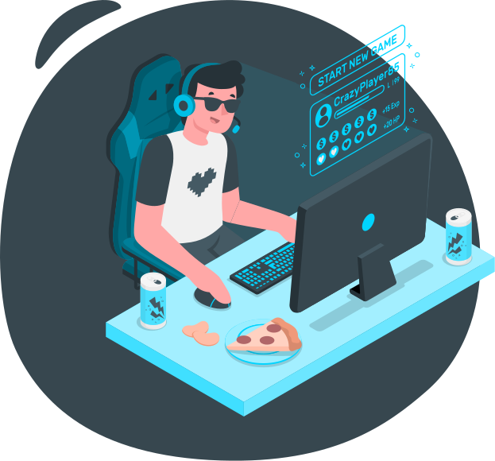
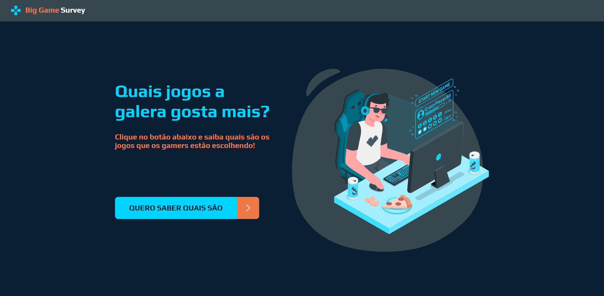
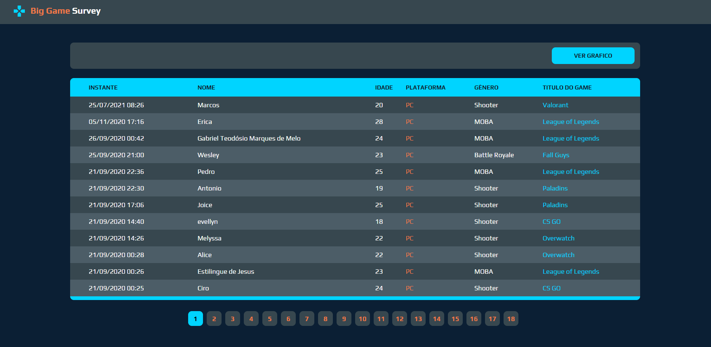
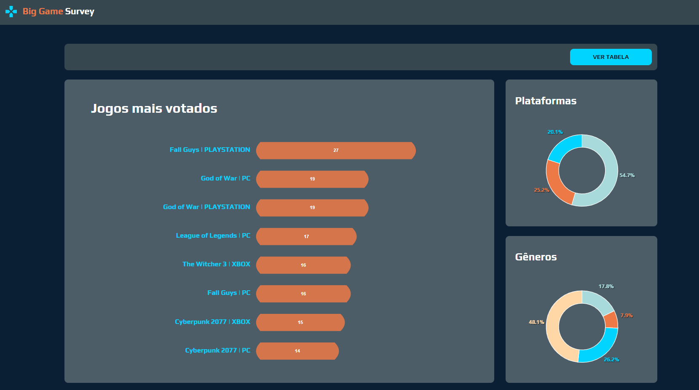
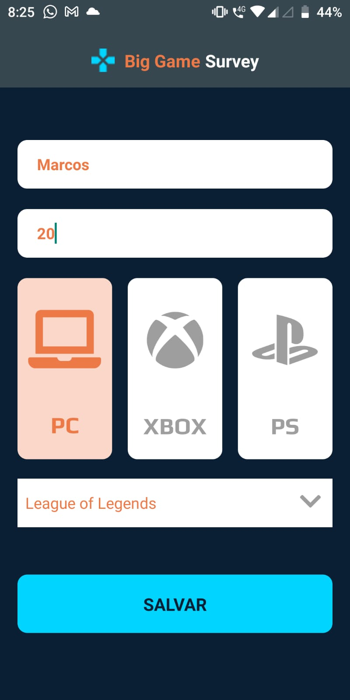

<p align="center">
  <a href="https://sdsgabriel.netlify.app/" target="_blank">
    
  </a>
</p>

<h1 align="center">Big Game Survey</h1>
<p align="center">Projeto realizado durante a Semana DevSuperior 1.0</p>

<p align="center">
  

  <a href="https://github.com/gabrielvieira1/sds1.0/blob/master/LICENSE" target="_blank">
    
  </a>
   
  
  
  
  
  <a href="https://www.linkedin.com/in/bielvieira/" target="_blank">
        
    </a>
    <a href="mailto:gabrielvieira4102@gmail.com" target="_blank">
        
    </a>
    <a href="https://twitter.com/bielvieir4" target="_blank">
        
    </a>
</p>

<p align="center">
  <a href="#-about-the-project">About the project</a>&nbsp;&nbsp;&nbsp;|&nbsp;&nbsp;&nbsp;
  <a href="#-layout">Layout</a>&nbsp;&nbsp;&nbsp;|&nbsp;&nbsp;&nbsp;
  <a href="#-technologies">Technologies</a>&nbsp;&nbsp;&nbsp;|&nbsp;&nbsp;&nbsp;
  <a href="#-how-to-install">How to install</a>&nbsp;&nbsp;&nbsp;|&nbsp;&nbsp;&nbsp;
  <a href="#-how-to-contribute">How to contribute</a>&nbsp;&nbsp;&nbsp;|&nbsp;&nbsp;&nbsp;
  <a href="#memo-license">License</a>
</p>

# 📖 About the project
<p>O Big Game Survey tem por objetivo criar um sistema de pesquisa capaz de informar quais os games mais jogados atualmente. Durante o desenvolvimento foi criada uma API que recebe esse voto apartir de um app mobile e faz o registro no banco:</p>

- GET /records: retorna todos os registros dos usuário que já votaram em forma de tabela;
- GET /charts: retorna todos os registros dos usuário que já votaram em forma de grafico;
- POST /games: envia as informações do voto que o usuário fez para o banco de dados.

<p>A landing page é composta por duas frases, uma de efeito e outra com instruções para os usuários, uma imagem e um botão que levará o usuário à tela responsável pela listagem de votos dos usuário, que, por sua vez, é uma
página que possui informações dos votos detalhados e a proxíma tela é a dos graficos com informações mais resumida. E por último a tela do app onde o usuário pode registrar seu voto.</p>

# 🔖 Layout

<h1 align="center">
    
</h1>

<h1 align="center">
    
</h1>

<h1 align="center">
    
</h1>

<h1 align="center">
    
</h1>

# 🛠 Technologies

This project was developed with the following technologies:

<h4>Front-end e mobile:</h4>

- [HTML](https://www.w3schools.com/html/)
- [CSS](https://www.w3schools.com/css/)
- [JavaScript](https://www.javascript.com/)
- [TypeScript](https://www.typescriptlang.org/)
- [ReactJS](https://pt-br.reactjs.org/)
- [React Native](https://reactnative.dev/)

<h4>Back-end:</h4>

- [Java](https://www.java.com/pt-BR/)
- [Springboot](https://spring.io/projects/spring-boot)
- [PostgreeSQL](https://www.postgresql.org/)


# 👨‍💻 How to install

```bash
# Clone this repository
$ git clone https://github.com/gabrielvieira1/sds1.0.git

# Go into the repository folder and install dependencies
$ cd sds1.0

# Run
$ npm install

$ npm start
```

## 🤔 How to contribute

- Make a fork;
- Create a branck with your feature: `git checkout -b my-feature`;
- Commit changes: `git commit -m 'feat: My new feature'`;
- Make a push to your branch: `git push origin my-feature`.

After merging your receipt request to done, you can delete a branch from yours.

## :memo: License

This project is under the MIT license. See the [LICENSE](LICENSE) for details.

Made with ♥ by Gabriel Vieira :wave: [Get in touch!](https://www.linkedin.com/in/bielvieira/)
